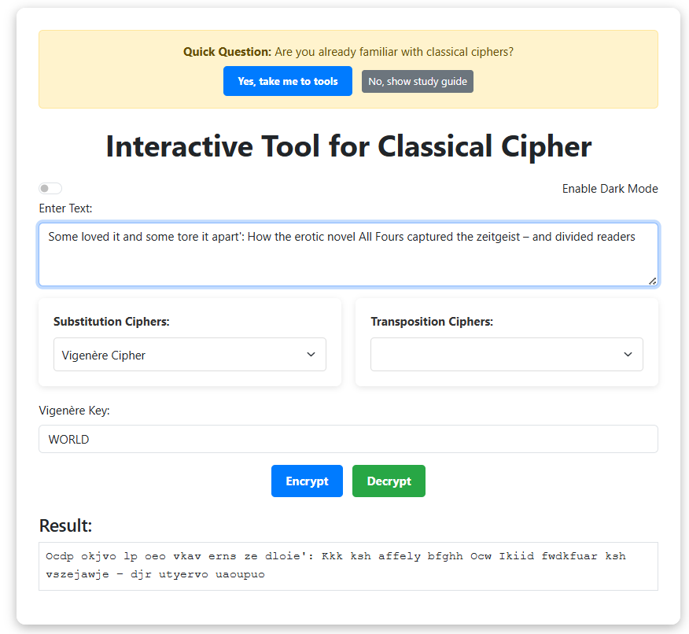
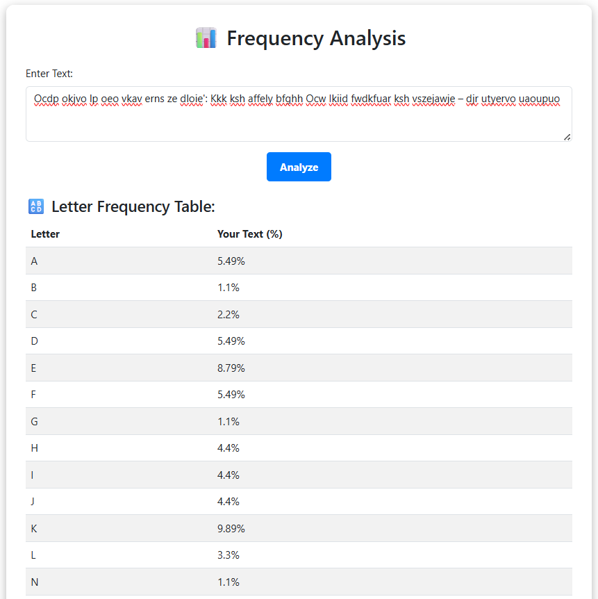
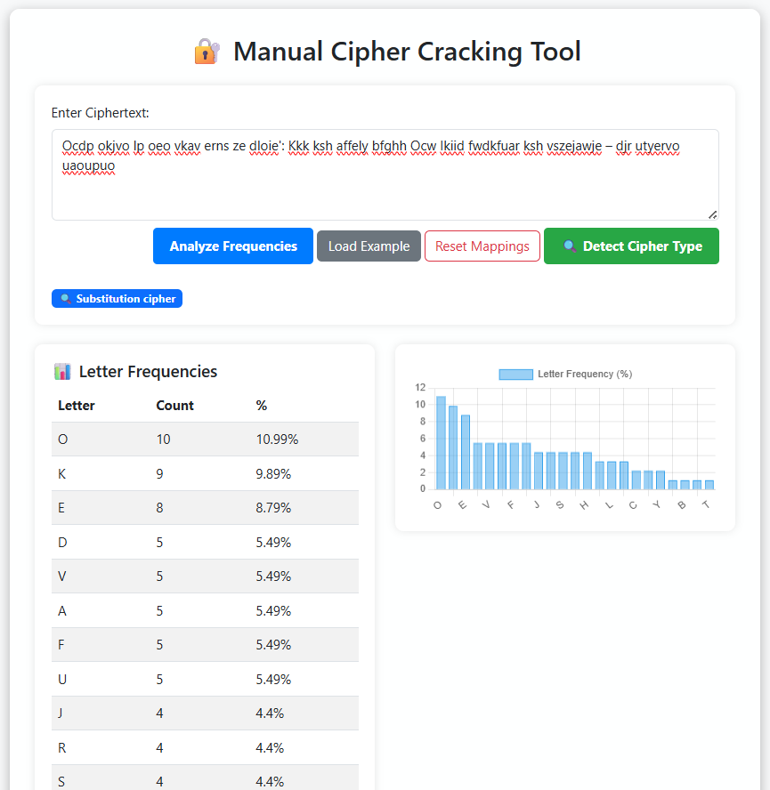
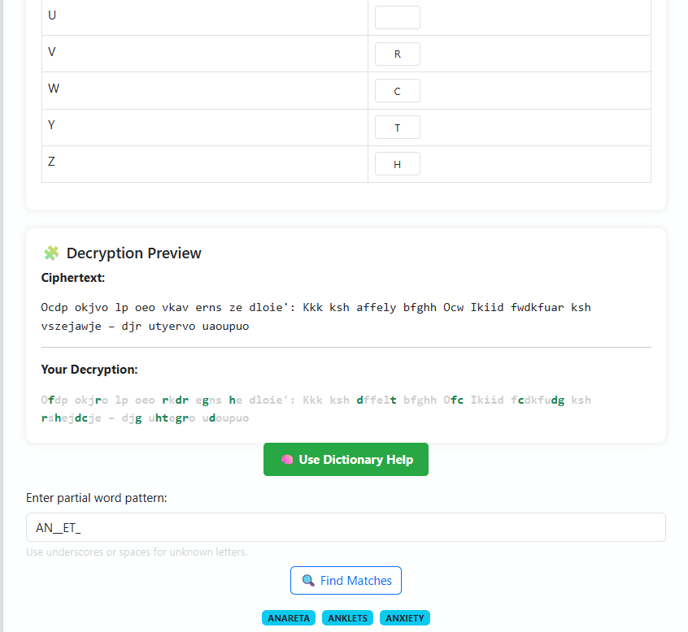
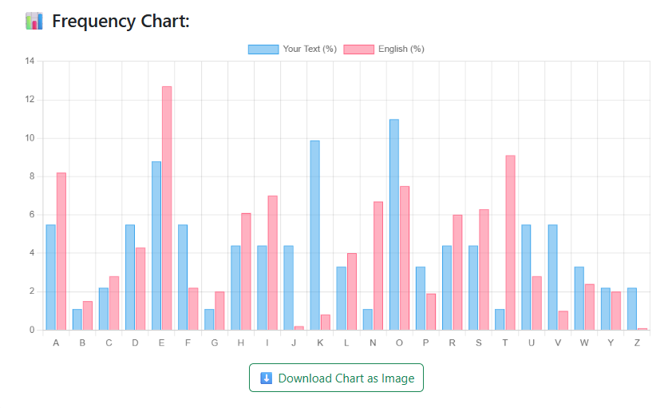

# 🔐 Interactive Cryptanalysis and cryptography Tool for Classical Ciphers

A web-based interactive tool that helps users decrypt classical ciphers like Caesar, Vigenère, and Playfair. This educational tool combines manual analysis with semi-automated suggestions to aid in cryptanalysis, ideal for learners and researchers in classical cryptography.

---

## ✨ Features

- 🧠 Manual substitution cipher cracking with live plaintext preview
- 📊 Letter frequency analysis for ciphertext
- 📚 Dictionary-based auto-suggestion to guess likely plaintext words
- 🔍 Pattern matching to assist decryption
- 🛠️ Auto-detection of cipher category (currently works for differentiating substitution or transposition)
- 📖 Study Guide with theory, diagrams, and examples
- 🎮 Interactive components: quizzes and flashcards (in study mode)

---

## 🔧 Technologies Used

- **Frontend:** HTML5, CSS3, Bootstrap, JavaScript
- **Backend:** Python (Flask)
- **Tools:** `words_alpha.txt` for dictionary matching, Matplotlib (optional for graphs)

---

## 🏗️ Project Structure

```
/cryptanalysis-tool
│
├── frontend/            # CSS, JS files, HTML templates
├── backend/             # Python cipher algorithms (Caesar, Vigenère, Playfair,etc), Flask application entry point
└── README.md
```

---

## 🚀 Getting Started

### Prerequisites

- Python 3.7+
- pip

### Installation

```bash
git clone https://github.com/sarvadnyalad/Cryptanalysis-and-cryptography-of-classical-ciphers.git
cd Cryptanalysis-and-cryptography-of-classical-ciphers
pip install -r requirements.txt
python app.py
```

Then run the index.html file on any browser from frontend folder to open project dashboard alternatively you can  visit `http://127.0.0.1:5000/` in your browser.

---

## 📌 Supported Ciphers

- Caesar Cipher
- Vigenère Cipher
- Playfair Cipher
- Rail Fence Cipher
- Columnar Cipher

More ciphers and tools will be added in future updates.

---

## 📸 Screenshots






---

## 👨‍🎓 Educational Use

This tool was developed as part of an MSc Computer Science project at the University of Leicester, aimed at enhancing understanding of classical cipher cryptanalysis through interactivity.

---

## 🪪 License

This project is licensed under the MIT License. See [LICENSE](LICENSE) for details.

---

## 🤝 Acknowledgments

- [words_alpha](https://github.com/dwyl/english-words) dictionary
- University of Leicester – Cryptography and Security module inspiration

---

## 📬 Contact

Sarvadnya Lad  
[GitHub](https://github.com/sarvadnyalad) • [LinkedIn](https://www.linkedin.com/in/sarvadnya-lad-23793421b/)
